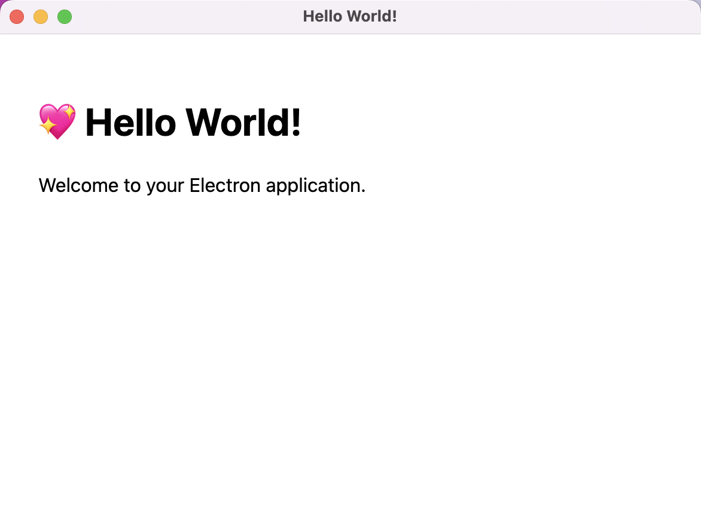
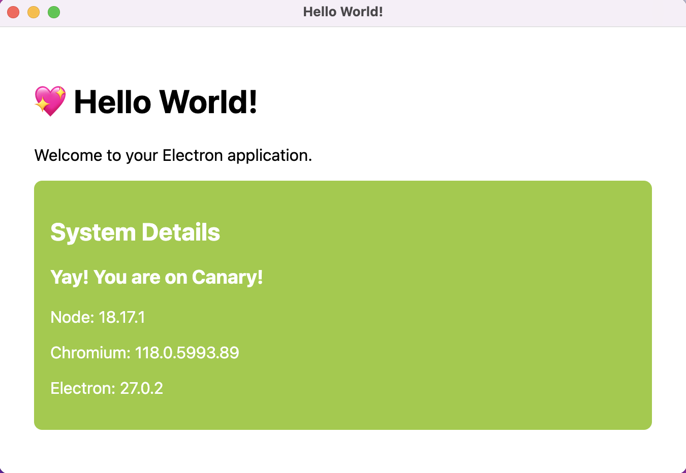

# POC - Using Feature Flags and Canary Releases with Electron

In this POC, we will be using a simple configuration file to enable/disable features based on the version of the application.

This is a simple example of how to use feature flags and canary releases with Electron.

## What is a feature flag?

> A feature toggle in software development provides an alternative to maintaining multiple feature branches in source code. A condition within the code enables or disables a feature during runtime. In agile settings the toggle is used in production, to switch on the feature on demand, for some or all the users. Thus, feature toggles do make it easier to release often. Advanced roll out strategies such as canary roll out and A/B testing are easier to handle. [Wikipedia](https://en.wikipedia.org/wiki/Feature_toggle)

- [Atlassian | What is Feature Flagging?](https://www.atlassian.com/solutions/devops/integrations/feature-flags)
- [IBM Technology | What are Feature Flags?](https://www.youtube.com/watch?v=AJa2B-twtG4)

## What is a canary release?

> Canary release is a technique to reduce the risk of introducing a new software version in production by slowly rolling out the change to a small subset of users before rolling it out to the entire infrastructure and making it available to everybody. [Danilo Sato](https://martinfowler.com/bliki/CanaryRelease.html)

- [Martin Fowler | CanaryRelease](https://martinfowler.com/bliki/CanaryRelease.html)
- [What Is Canary Deployment?](https://semaphoreci.com/blog/what-is-canary-deployment)


## Demo: How to use it

You will need to overwrite the version in the `package.json` file to test the different features.

If the version is `1.0.0`, the feature `showSystemDetails` will not be enabled.



But if the version includes the word `canary` like in `1.0.0-canary-1698421392972`, then `showSystemDetails` will be enabled and you will see additional information in the UI:.




## Start

```bash
npm install
npm start
```

## Building distributables

```bash
npm run make
```